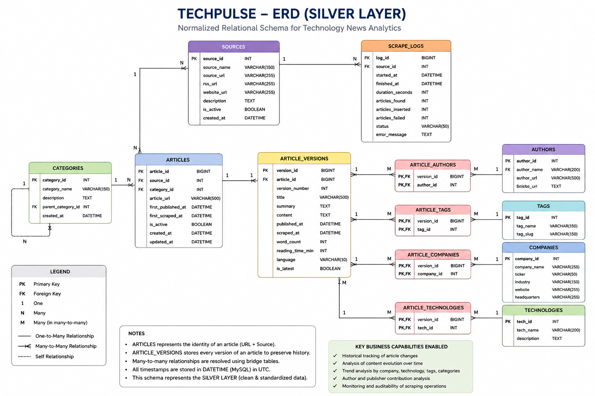

#### In this md file we are going to demonstrate how we achieved the way we achieved it.

##### We will later summarize it.


### Phase I - Project Setup
- Create the project folder. --> Techpulse
- Initialized git.
- Created a virtual environment for python dependencies.
    - We created it using the command `python -m venv .venv`
    - We used it using the command --> `.venv\Scripts\activate`
- Inside the root folder we created the following architecture:
    ```text
    TechPulse/
    │
    ├── data/
    │   ├── raw/
    │   ├── processed/
    │   └── archive/
    │
    ├── scrapers/
    │   ├── common/
    │   └── sources/
    │
    ├── database/
    │
    ├── etl/
    │
    ├── analysis/
    │
    ├── dashboard/
    │
    ├── notebooks/
    │
    ├── reports/
    │
    ├── config/
    │
    ├── logs/
    │
    ├── tests/
    │
    └── docs/
    ```
    - Purpose of there folders:
    | Folder         | Purpose                      |
    | -------------- | ---------------------------- |
    | data/raw       | Original scraped data        |
    | data/processed | Cleaned datasets             |
    | data/archive   | Historical backups           |
    | scrapers       | All scraping scripts         |
    | database       | SQL scripts, ERD, schema     |
    | etl            | Data cleaning and loading    |
    | analysis       | Python analysis scripts      |
    | dashboard      | Tableau workbook and exports |
    | notebooks      | Jupyter notebooks            |
    | reports        | Generated reports            |
    | config         | Configuration files          |
    | logs           | Scraper and ETL logs         |
    | tests          | Unit tests                   |
    | docs           | Documentation and diagrams   |

    - The structure scales well when the project grows.

- Created the required essential files:
    1. README.md
    2. requirements.txt
    3. .gitignore
    4. LICENSE
    5. main.py
- Created the .gitignore and entered the text:
    ```gitignore
    # Virtual Environment
    .venv/

    # Python Cache
    __pycache__/
    *.pyc

    # Jupyter
    .ipynb_checkpoints/

    # VS Code
    .vscode/

    # Environment Variables
    .env

    # Logs
    logs/*.log

    # Data
    data/raw/*
    data/processed/*
    !data/raw/.gitkeep
    !data/processed/.gitkeep

    # OS
    .DS_Store
    Thumbs.db
    ```
- Sometimes the git doesn't track empty files:
    So we created .gitkeep files for different folders like:
    ```text
    data/raw/.gitkeep

    data/processed/.gitkeep

    data/archive/.gitkeep

    logs/.gitkeep

    reports/.gitkeep

    tests/.gitkeep
    ```
- Then we installed the required libraries for this entire project using the command:
```bash
pip install requests beautifulsoup4 pandas numpy sqlalchemy pymysql lxml python-dotenv tqdm matplotlib nltk spacy jupyter
```
    ```text
    | Package          | Purpose                                                  |
    | ---------------- | -------------------------------------------------------- |
    | `requests`       | Download web pages                                       |
    | `beautifulsoup4` | Parse HTML                                               |
    | `lxml`           | Faster HTML/XML parsing                                  |
    | `pandas`         | Clean and analyze data                                   |
    | `numpy`          | Numerical operations                                     |
    | `sqlalchemy`     | Connect Python to MySQL using an ORM or SQL layer        |
    | `pymysql`        | MySQL database driver                                    |
    | `python-dotenv`  | Load configuration from `.env` files                     |
    | `tqdm`           | Progress bars for long-running tasks                     |
    | `matplotlib`     | Data visualization during analysis                       |
    | `nltk` / `spaCy` | NLP tasks like tokenization and named entity recognition |
    | `jupyter`        | Interactive notebooks for exploration      
    ```
- After installing all required Python libraries, the project dependenciesw ere frozen into a requirements.txt file using `pip freeze > requirements.txt`. This records the exact versions of all installed packages, allowing anyone who clones the repository to recreate the same development environment using `pip install -r requirements.txt`. This ensures consistency, reproducibility, and easier collaboration across different systems.
- We added the initail basic info into the readme which we will expand as the project grows.
- Now that the structure is complete we will now give our first commit and push it to git hub.
- In order to make this project properly developed, we created a directory called as 'src' where we will store all the python code rather than placing the scripts in th root. So we moved the previously created the code directories into src directory.
    ```text
    TechPulse/
    │
    ├── src/
    │   ├── scrapers/
    │   ├── etl/
    │   ├── analysis/
    │   └── utils/
    ```


### Phase II - System Design

- Before writing the a single scraper, we're going to answer an important question:

> **How will data flow through our system?**

- Therefore, we defined a data pipeline:
```text
News Websites
      │
      ▼
Web Scraper
      │
      ▼
Raw Data (JSON)
      │
      ▼
ETL Pipeline
      │
      ▼
MySQL Database
      │
      ▼
SQL Analysis
      │
      ▼
Python Analysis & NLP
      │
      ▼
Tableau Dashboard
```
    - We do this so that each component has one responsibility:
    ```text
    | Component | Responsibility      |
    | --------- | ------------------- |
    | Scraper   | Collect data        |
    | ETL       | Clean and transform |
    | Database  | Store data          |
    | SQL       | Query and aggregate |
    | Python    | Advanced analysis   |
    | Tableau   | Visualize           |
    ```
    - This follows a **single responsibility principle**.

- We decided the data sources next. We will be using a hypbrid approach
    - Steps:
    1. Collect the latest article links from RSS feeds (wherever available).
    2. Visit Each article page and scrape the detailed information.

    - The initial 4 sources that we decided are 
    ```text
    | Source       | Why we chose it                 |
    | ------------ | ------------------------------- |
    | TechCrunch   | Startups, AI, funding, big tech |
    | The Verge    | Consumer technology and gadgets |
    | Ars Technica | Deep technical articles         |
    | VentureBeat  | AI, enterprise tech, startups   |

    These sources cover different areas of technology, which will make your analyses more interesting.
    ```
- One more thing which is important is to define a comman schema for all the sources so that even if they have different formats the data that we will save in the database will have consistency.
- For every source the pipeline will look like:
    ```text
    RSS Feed
        ↓
    Get article links
        ↓
    Visit article page
        ↓
    Extract data
        ↓
    Convert to common schema
        ↓
    Save as JSON
        ↓
    Run ETL
        ↓
    Store in MySQL
    ```
- **MY FIRST SOFTWARE ENGINEERING LESSON: ( Atlesdt, Thats what he said )**
    - A beginner always thinks: 
        > 'I'm building a scraper.'
    - An experienced developer thinks:
        > 'I'm Building a **frameword** that can support many scrappers.'
    
- Now we will design the **MySQL database from scratch**. We will identify all the entities, normalize the schema and create an ERD.
- Before creating the database we must first answer the questions :
> "What information does the business need to store ?"
> "What table are required to be created ?"

- To acheive a nice database we will proceed in following steps:
1. Understand the Business:
    > 'What information do we need ?'
    > 'What are the **things** in this system ?'
2. Identify entities:
    - An entity is something about which we want to store the information.
    Ex:
    ```
    Article

    Author

    Source

    Category

    Tag

    Company

    Technology
    ```
3. Determine Relationships: How are these entities connected ?
    1. Source --> articles ( 1 - many )
    2. Author --> articles ( 1 - many )
    3. Category --> articles ( 1 - many )
    4. Article --> Tags ( Many - Many ) --> We solve this using the bridge table
    5. Article --> Company ( Many - Many ) --> Bridge table.
    6. Article --> Technology ( Many - Many ) --> Bridge Table.
4. Think about future requirements: 
    - We should think in following manner:
    1. Tomorrow if we add another source into our list, will the database handle it ? Yes, because we are creating a seperate source table.
    2. Tomorrow if an article has 5 authors, will we support it ? yes , if we design carefully.
    3. If tomorrow we scrape 50 websites, our database will still withstand.
    4. If we scrape 100,000 articles/day, our database will still hold on.
    5. Define the tables that we will need.
    - Eventually our database will look like this -->
    ```
    techpulse

    │

    ├── articles ( Core )

    ├── authors ( Core )

    ├── sources ( Core )

    ├── categories ( Core )

    ├── companies ( Lookup )

    ├── technologies ( Lookup )

    ├── tags ( Lookup )

    ├── article_tags ( Bridge )

    ├── article_companies ( Bridge )

    ├── article_technologies ( Bridge )

    └── scrape_logs ( Operational )
    ```
- Now we will design the ERD. 



- We can add two more tables to the database for better debugging. The two tables are --> 
1. scrape_jobs --> To understand where the job failed.
2. article_metrics --> For attributes like sentiment score, readability score etc.

### Phase III - Database Architect Design.

- We will proceed in steps from here:
1. I created two sql scripts.
    1. 01_create_database.sql
    2. 02_create_tables.sql

> "What is the heart of our system ?" --> **Articles**

- Articles table become our **fact table**.

- In first file we write the code :
```sql
CREATE DATABASE techpulse;

USE techpulse;
```

- Now i gave the second commit of the project. Creation of the database.

2.  We must decide the Data Architecture at this point. We ask :
> 'Where does every peice of data belong ?'.
- Now for this instead of thinking in tables we will think this in layers:
    1. Bronze Layer :
    - This layer contains the content exactly as we scraped it.
    - Even if there are any inconsistencies in the data.
    2. Silver Layer :
    - This layer will contain the clean and standardized data.
    - This is what most analysts will use.
    3. Gold Layer :
    - This layer stores business-ready analytics.
    1. Daily Article Counts
    2. Company mention Counts
    3. Technology trends etc....
    - This is optimized for dashboards and reporting only.
3. If we map tables according to the layer method we have:
    1. Bronze Layer :
    - bronze_articles
    - bronze_scrape_logs

    2. Silver Layer :
    - articles
    - article_versions
    - authors
    - sources
    - categories
    - companies
    - technologies
    - tags

    - article_authors
    - article_companies
    - article_technologies
    - article_tags

    3. Gold Layer :
    - daily_article_metrics
    - company_trends
    - technology_trends
    - source_metrics
    - category_metrics

4. Define the ETL Flow :
    Website

      ↓

    Bronze

      ↓

    Cleaning

      ↓

    Silver

      ↓

    Aggregation

      ↓

    Gold

      ↓

    Tableau

5. Create the ERD:
- This is already created above.


6. Creation of necessary documents:
- We created the docs and named in numerical order. This demonstrated the procedure:
    1. 01_business_requirements.md --> Defines the database architecture, schema, relationships, and data flow for TechPulse.
    2. 02_system_architecture.md --> Defines TechPulse's system architecture, data flow, components, and technology stack.
    3. 03_database_design_specification.md -->  Defines the TechPulse database architecture, schema, relationships, and design principles.

### Phase IV - Database implementation.

#### Section I - Creation of Database Tables:

- Our database is already created.
- Now we will create our tables. We will proceed in dependency order so that foreign keys and all should not face any problem.
- Creation:
1. Table: sources
    - The sources table stores the data about every news publisher from which Techpulse collects articles.
    - Instead of repeating publisher information in every article we normalize it into a dedicated table.
    - This helps us in adding new sources etc.,.

    - For each source we ask the questions:
    1. What is its name ?
    2. What is the website ?
    3. What RSS feed does it expose ?
    4. What language does it publish in ?
    5. Which country is it based on ?
    6. Is scraping currently possible or enabled ?
    - Schema:
    ```sql
    -- Sources Table: Stores the metadata about technology news publishers.

    CREATE TABLE sources (
        source_id INT PRIMARY KEY AUTO_INCREMENT,
        source_name VARCHAR(100) NOT NULL UNIQUE,
        website_url VARCHAR(500) NOT NULL UNIQUE,
        rss_feed_url VARCHAR(500) NULL UNIQUE,
        country VARCHAR(100) NULL,
        language CHAR(2) NOT NULL DEFAULT 'en',
        is_active BOOLEAN NOT NULL DEFAULT TRUE,
        created_at TIMESTAMP NOT NULL DEFAULT CURRENT_TIMESTAMP,
        updated_at TIMESTAMP NOT NULL DEFAULT CURRENT_TIMESTAMP ON UPDATE CURRENT_TIMESTAMP
    );
    ```
2. Table: categories
    - The categories table stores list of standardized news categories used throughout the platform.
    - It ensures consistent naming, Easier Filtering and No duplicate entries.
    - Schema:
    ```sql
    -- Categories Table: It stores the list of standardized news categories used throughout the platform.

    CREATE TABLE categories (
        category_id INT PRIMARY KEY AUTO_INCREMENT,
        category_name VARCHAR(100) NOT NULL UNIQUE,
        created_at TIMESTAMP NOT NULL DEFAULT CURRENT_TIMESTAMP
    );
    ```
3. Table: authors
    - This is a difficult table as it required many to many relationship between authors and articles.
    - Schema:
    ```sql
    -- Authors Table: This tables stores the list of authors for whom we have scraped the articles

    CREATE TABLE authors (
        author_id INT PRIMARY KEY AUTO_INCREMENT,
        source_id INT NOT NULL,
        display_name VARCHAR(150) NOT NULL,
        profile_url VARCHAR(255),
        created_at TIMESTAMP NOT NULL DEFAULT CURRENT_TIMESTAMP,
        
        CONSTRAINT fk_author_source
            FOREIGN KEY (source_id)
            REFERENCES sources(source_id),
            
        UNIQUE(source_id, display_name)
    );
    ```

4. Table: companies
    - Schema:
    ```sql
    -- Companies table: This table stores the list of organisations mentioned in the article

    CREATE TABLE companies (
        company_id INT PRIMARY KEY AUTO_INCREMENT,
        company_name VARCHAR(150),
        created_at TIMESTAMP NOT NULL DEFAULT CURRENT_TIMESTAMP
    );
    ```
5. Table: technologies
    - Schema:
    ```sql
    -- Technologies table: This table stores the information about the technologies mentioned in the article

    CREATE TABLE technologies (
        technology_id INT PRIMARY KEY AUTO_INCREMENT,
        technology_name VARCHAR(100),
        created_at TIMESTAMP NOT NULL DEFAULT CURRENT_TIMESTAMP
    );
    ```
6. Table: tags
    - Schema:
    ```sql
    -- Tags table: This table will store the topics as tags for proper filtering og the articles

    CREATE TABLE tags (
        tag_id INT PRIMARY KEY AUTO_INCREMENT,
        tag_name VARCHAR(100) NOT NULL UNIQUE,
        created_at TIMESTAMP NOT NULL DEFAULT CURRENT_TIMESTAMP
    );
    ```
7. Table: **articles**
    - This is the most important and most complex table of this database so far.
    ```sql
    CREATE TABLE articles (
    article_id INT PRIMARY KEY AUTO_INCREMENT,
    article_url VARCHAR(1000) NOT NULL UNIQUE,
    source_id INT NOT NULL,
    category_id INT NOT NULL,

    title VARCHAR(300) NOT NULL,
    summary TEXT,
    content LONGTEXT,

    published_at DATETIME,
    scraped_at TIMESTAMP NOT NULL DEFAULT CURRENT_TIMESTAMP,

    word_count INT,
    reading_time SMALLINT,

    content_hash CHAR(64) NOT NULL,

    created_at TIMESTAMP NOT NULL DEFAULT CURRENT_TIMESTAMP,
    updated_at TIMESTAMP NOT NULL DEFAULT CURRENT_TIMESTAMP
        ON UPDATE CURRENT_TIMESTAMP,

    CONSTRAINT fk_articles_source
        FOREIGN KEY (source_id)
        REFERENCES sources(source_id),

    CONSTRAINT fk_articles_category
        FOREIGN KEY (category_id)
        REFERENCES categories(category_id)
    );
    ```
8. Now we will design the bridge tables for our many - many relationship.
    1. Table: article-authors:
        ```sql
        CREATE TABLE articles (
        article_id INT PRIMARY KEY AUTO_INCREMENT,
        article_url VARCHAR(1000) NOT NULL UNIQUE,
        source_id INT NOT NULL,
        category_id INT NOT NULL,

        title VARCHAR(300) NOT NULL,
        summary TEXT,
        content LONGTEXT,

        published_at DATETIME,
        scraped_at TIMESTAMP NOT NULL DEFAULT CURRENT_TIMESTAMP,

        word_count INT,
        reading_time SMALLINT,

        content_hash CHAR(64) NOT NULL,

        created_at TIMESTAMP NOT NULL DEFAULT CURRENT_TIMESTAMP,
        updated_at TIMESTAMP NOT NULL DEFAULT CURRENT_TIMESTAMP
            ON UPDATE CURRENT_TIMESTAMP,

        CONSTRAINT fk_articles_source
            FOREIGN KEY (source_id)
            REFERENCES sources(source_id),

        CONSTRAINT fk_articles_category
            FOREIGN KEY (category_id)
            REFERENCES categories(category_id)
        );
        ```

    2. Table: article_companies
        ```sql
        CREATE TABLE article_companies (
        article_id INT NOT NULL,
        company_id INT NOT NULL,

        PRIMARY KEY (article_id, company_id),

        CONSTRAINT fk_article_companies_article
            FOREIGN KEY (article_id)
            REFERENCES articles(article_id)
            ON DELETE CASCADE
            ON UPDATE CASCADE,

        CONSTRAINT fk_article_companies_company
            FOREIGN KEY (company_id)
            REFERENCES companies(company_id)
            ON DELETE RESTRICT
            ON UPDATE CASCADE
        );
        ```

    3. Table: article_technologies
        ```sql
        CREATE TABLE article_technologies (
        article_id INT NOT NULL,
        technology_id INT NOT NULL,

        PRIMARY KEY (article_id, technology_id),

        CONSTRAINT fk_article_technologies_article
            FOREIGN KEY (article_id)
            REFERENCES articles(article_id)
            ON DELETE CASCADE
            ON UPDATE CASCADE,

        CONSTRAINT fk_article_technologies_technology
            FOREIGN KEY (technology_id)
            REFERENCES technologies(technology_id)
            ON DELETE RESTRICT
            ON UPDATE CASCADE
        );  
        ```

    4. Table: article_tags
        ```sql
        CREATE TABLE article_tags (
        article_id INT NOT NULL,
        tag_id INT NOT NULL,

        PRIMARY KEY (article_id, tag_id),

        CONSTRAINT fk_article_tags_article
            FOREIGN KEY (article_id)
            REFERENCES articles(article_id)
            ON DELETE CASCADE
            ON UPDATE CASCADE,

        CONSTRAINT fk_article_tags_tag
            FOREIGN KEY (tag_id)
            REFERENCES tags(tag_id)
            ON DELETE RESTRICT
            ON UPDATE CASCADE
        );
        ```

9. Final Table: scrape_logs
    ```sql
    CREATE TABLE scrape_logs (
    log_id INT PRIMARY KEY AUTO_INCREMENT,
    source_id INT NOT NULL,

    scrape_started_at TIMESTAMP NOT NULL,
    scrape_completed_at TIMESTAMP NULL,

    articles_found INT NOT NULL DEFAULT 0,
    articles_inserted INT NOT NULL DEFAULT 0,

    status ENUM('SUCCESS', 'FAILED', 'PARTIAL') NOT NULL,

    error_message TEXT,

    created_at TIMESTAMP NOT NULL DEFAULT CURRENT_TIMESTAMP,

    CONSTRAINT fk_scrape_logs_source
        FOREIGN KEY (source_id)
        REFERENCES sources(source_id)
        ON DELETE RESTRICT
        ON UPDATE CASCADE
    );
    ```

#### Section II - Creation Of Indexes

- We created the indexes using the code:
```sql
-- Articles
CREATE INDEX idx_articles_source
ON articles(source_id);

CREATE INDEX idx_articles_category
ON articles(category_id);

CREATE INDEX idx_articles_published_at
ON articles(published_at);

-- Authors
CREATE INDEX idx_authors_source
ON authors(source_id);

-- Scrape Logs
CREATE INDEX idx_scrape_logs_source
ON scrape_logs(source_id);

CREATE INDEX idx_scrape_logs_status
ON scrape_logs(status);
```

#### Section III - Creation of Views:

```sql
-- Creating the Views


-- 1. Article Details
CREATE VIEW vw_article_details AS
SELECT
    a.article_id,
    a.title,
    a.summary,
    a.article_url,
    s.source_name,
    c.category_name,
    a.published_at,
    a.scraped_at,
    a.word_count,
    a.reading_time
FROM articles a
JOIN sources s
    ON a.source_id = s.source_id
JOIN categories c
    ON a.category_id = c.category_id;


-- 2. Company Mentions
CREATE VIEW vw_article_details AS
SELECT
    a.article_id,
    a.title,
    a.summary,
    a.article_url,
    s.source_name,
    c.category_name,
    a.published_at,
    a.scraped_at,
    a.word_count,
    a.reading_time
FROM articles a
JOIN sources s
    ON a.source_id = s.source_id
JOIN categories c
    ON a.category_id = c.category_id;
    
-- Technology Mentions
CREATE VIEW vw_technology_mentions AS
SELECT
    a.article_id,
    a.title,
    t.technology_name,
    s.source_name,
    a.published_at
FROM article_technologies at
JOIN articles a
    ON at.article_id = a.article_id
JOIN technologies t
    ON at.technology_id = t.technology_id
JOIN sources s
    ON a.source_id = s.source_id;


-- Author Details
CREATE VIEW vw_article_authors AS
SELECT
    a.article_id,
    a.title,
    au.display_name,
    s.source_name,
    a.published_at
FROM article_authors aa
JOIN articles a
    ON aa.article_id = a.article_id
JOIN authors au
    ON aa.author_id = au.author_id
JOIN sources s
    ON a.source_id = s.source_id;
    
    
-- Tag Details
CREATE VIEW vw_article_tags AS
SELECT
    a.article_id,
    a.title,
    t.tag_name,
    s.source_name,
    a.published_at
FROM article_tags at
JOIN articles a
    ON at.article_id = a.article_id
JOIN tags t
    ON at.tag_id = t.tag_id
JOIN sources s
    ON a.source_id = s.source_id;
    

-- Scraping Activity
CREATE VIEW vw_scrape_summary AS
SELECT
    sl.log_id,
    s.source_name,
    sl.scrape_started_at,
    sl.scrape_completed_at,
    sl.articles_found,
    sl.articles_inserted,
    sl.status
FROM scrape_logs sl
JOIN sources s
    ON sl.source_id = s.source_id;
```

#### Section IV : Creating Seed Data.

```sql


-- Seed Data

-- Sources Table
INSERT INTO sources (
    source_name,
    website_url,
    rss_feed_url,
    country,
    language
)
VALUES
('TechCrunch','https://techcrunch.com','https://techcrunch.com/feed/','USA','en'),

('The Verge','https://www.theverge.com','https://www.theverge.com/rss/index.xml','USA','en'),

('Ars Technica','https://arstechnica.com','https://feeds.arstechnica.com/arstechnica/index','USA','en'),

('VentureBeat','https://venturebeat.com','https://venturebeat.com/feed/','USA','en');


-- Categories Table

INSERT INTO categories (category_name)
VALUES
('Artificial Intelligence'),
('Cloud Computing'),
('Cybersecurity'),
('Programming'),
('Robotics'),
('Startups'),
('Consumer Technology'),
('Data Science');

-- Technologies Table
INSERT INTO technologies (technology_name)
VALUES
('Python'),
('Docker'),
('Kubernetes'),
('TensorFlow'),
('PyTorch'),
('CUDA'),
('MySQL'),
('PostgreSQL'),
('React'),
('Node.js'),
('LangChain'),
('Apache Spark');


-- Tags
INSERT INTO technologies (technology_name)
VALUES
('Python'),
('Docker'),
('Kubernetes'),
('TensorFlow'),
('PyTorch'),
('CUDA'),
('MySQL'),
('PostgreSQL'),
('React'),
('Node.js'),
('LangChain'),
('Apache Spark');


-- Companies 
INSERT INTO companies (company_name)
VALUES
('OpenAI'),
('Microsoft'),
('Google'),
('Meta'),
('Apple'),
('Amazon'),
('NVIDIA'),
('Anthropic'),
('Tesla');
```

#### Section V : Validation and Testing
```sql


-- Validation and Testing

SHOW TABLES;

DESCRIBE articles;
DESCRIBE article_authors;
DESCRIBE article_tags;
DESCRIBE article_technologies;
DESCRIBE categories;
DESCRIBE companies;
DESCRIBE scrape_logs;
DESCRIBE sources;
DESCRIBE tags;
DESCRIBE technologies;
DESCRIBE vw_article_details;
DESCRIBE vw_scrape_summary;
DESCRIBE vw_technology_mentions;

SHOW INDEX FROM articles;
SHOW INDEX FROM sources;
SHOW INDEX FROM authors;
SHOW INDEX FROM scrape_logs;

SELECT
    TABLE_NAME,
    COLUMN_NAME,
    CONSTRAINT_NAME,
    REFERENCED_TABLE_NAME
FROM information_schema.KEY_COLUMN_USAGE
WHERE TABLE_SCHEMA='techpulse'
AND REFERENCED_TABLE_NAME IS NOT NULL;

INSERT INTO articles
(
article_url,
source_id,
category_id,
title,
summary,
content,
published_at,
word_count,
reading_time,
content_hash
)
VALUES
(
'https://example.com/article1',
1,
1,
'OpenAI launches GPT-6',
'Summary',
'Content...',
NOW(),
800,
4,
SHA2('Content...',256)
);

SELECT * FROM articles LIMIT 10;

SELECT * FROM vw_article_details;
```


### Phase V - Web Scraper Development.