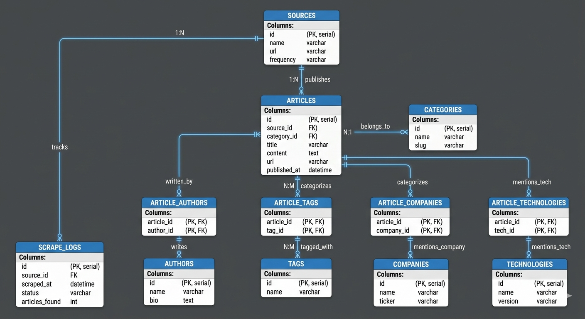

#### In this md file we are going to demonstrate how we achieved the way we achieved it.

##### We will later summarize it.


### Phase I - Project Setup
- Create the project folder. --> Techpulse
- Initialized git.
- Created a virtual environment for python dependencies.
    - We created it using the command `python -m venv .venv`
    - We used it using the command --> `.venv\Scripts\activate`
- Inside the root folder we created the following architecture:
    ```text
    TechPulse/
    │
    ├── data/
    │   ├── raw/
    │   ├── processed/
    │   └── archive/
    │
    ├── scrapers/
    │   ├── common/
    │   └── sources/
    │
    ├── database/
    │
    ├── etl/
    │
    ├── analysis/
    │
    ├── dashboard/
    │
    ├── notebooks/
    │
    ├── reports/
    │
    ├── config/
    │
    ├── logs/
    │
    ├── tests/
    │
    └── docs/
    ```
    - Purpose of there folders:
    | Folder         | Purpose                      |
    | -------------- | ---------------------------- |
    | data/raw       | Original scraped data        |
    | data/processed | Cleaned datasets             |
    | data/archive   | Historical backups           |
    | scrapers       | All scraping scripts         |
    | database       | SQL scripts, ERD, schema     |
    | etl            | Data cleaning and loading    |
    | analysis       | Python analysis scripts      |
    | dashboard      | Tableau workbook and exports |
    | notebooks      | Jupyter notebooks            |
    | reports        | Generated reports            |
    | config         | Configuration files          |
    | logs           | Scraper and ETL logs         |
    | tests          | Unit tests                   |
    | docs           | Documentation and diagrams   |

    - The structure scales well when the project grows.

- Created the required essential files:
    1. README.md
    2. requirements.txt
    3. .gitignore
    4. LICENSE
    5. main.py
- Created the .gitignore and entered the text:
    ```gitignore
    # Virtual Environment
    .venv/

    # Python Cache
    __pycache__/
    *.pyc

    # Jupyter
    .ipynb_checkpoints/

    # VS Code
    .vscode/

    # Environment Variables
    .env

    # Logs
    logs/*.log

    # Data
    data/raw/*
    data/processed/*
    !data/raw/.gitkeep
    !data/processed/.gitkeep

    # OS
    .DS_Store
    Thumbs.db
    ```
- Sometimes the git doesn't track empty files:
    So we created .gitkeep files for different folders like:
    ```text
    data/raw/.gitkeep

    data/processed/.gitkeep

    data/archive/.gitkeep

    logs/.gitkeep

    reports/.gitkeep

    tests/.gitkeep
    ```
- Then we installed the required libraries for this entire project using the command:
```bash
pip install requests beautifulsoup4 pandas numpy sqlalchemy pymysql lxml python-dotenv tqdm matplotlib nltk spacy jupyter
```
    ```text
    | Package          | Purpose                                                  |
    | ---------------- | -------------------------------------------------------- |
    | `requests`       | Download web pages                                       |
    | `beautifulsoup4` | Parse HTML                                               |
    | `lxml`           | Faster HTML/XML parsing                                  |
    | `pandas`         | Clean and analyze data                                   |
    | `numpy`          | Numerical operations                                     |
    | `sqlalchemy`     | Connect Python to MySQL using an ORM or SQL layer        |
    | `pymysql`        | MySQL database driver                                    |
    | `python-dotenv`  | Load configuration from `.env` files                     |
    | `tqdm`           | Progress bars for long-running tasks                     |
    | `matplotlib`     | Data visualization during analysis                       |
    | `nltk` / `spaCy` | NLP tasks like tokenization and named entity recognition |
    | `jupyter`        | Interactive notebooks for exploration      
    ```
- After installing all required Python libraries, the project dependenciesw ere frozen into a requirements.txt file using `pip freeze > requirements.txt`. This records the exact versions of all installed packages, allowing anyone who clones the repository to recreate the same development environment using `pip install -r requirements.txt`. This ensures consistency, reproducibility, and easier collaboration across different systems.
- We added the initail basic info into the readme which we will expand as the project grows.
- Now that the structure is complete we will now give our first commit and push it to git hub.
- In order to make this project properly developed, we created a directory called as 'src' where we will store all the python code rather than placing the scripts in th root. So we moved the previously created the code directories into src directory.
    ```text
    TechPulse/
    │
    ├── src/
    │   ├── scrapers/
    │   ├── etl/
    │   ├── analysis/
    │   └── utils/
    ```


### Phase II - System Design

- Before writing the a single scraper, we're going to answer an important question:

> **How will data flow through our system?**

- Therefore, we defined a data pipeline:
```text
News Websites
      │
      ▼
Web Scraper
      │
      ▼
Raw Data (JSON)
      │
      ▼
ETL Pipeline
      │
      ▼
MySQL Database
      │
      ▼
SQL Analysis
      │
      ▼
Python Analysis & NLP
      │
      ▼
Tableau Dashboard
```
    - We do this so that each component has one responsibility:
    ```text
    | Component | Responsibility      |
    | --------- | ------------------- |
    | Scraper   | Collect data        |
    | ETL       | Clean and transform |
    | Database  | Store data          |
    | SQL       | Query and aggregate |
    | Python    | Advanced analysis   |
    | Tableau   | Visualize           |
    ```
    - This follows a **single responsibility principle**.

- We decided the data sources next. We will be using a hypbrid approach
    - Steps:
    1. Collect the latest article links from RSS feeds (wherever available).
    2. Visit Each article page and scrape the detailed information.

    - The initial 4 sources that we decided are 
    ```text
    | Source       | Why we chose it                 |
    | ------------ | ------------------------------- |
    | TechCrunch   | Startups, AI, funding, big tech |
    | The Verge    | Consumer technology and gadgets |
    | Ars Technica | Deep technical articles         |
    | VentureBeat  | AI, enterprise tech, startups   |

    These sources cover different areas of technology, which will make your analyses more interesting.
    ```
- One more thing which is important is to define a comman schema for all the sources so that even if they have different formats the data that we will save in the database will have consistency.
- For every source the pipeline will look like:
    ```text
    RSS Feed
        ↓
    Get article links
        ↓
    Visit article page
        ↓
    Extract data
        ↓
    Convert to common schema
        ↓
    Save as JSON
        ↓
    Run ETL
        ↓
    Store in MySQL
    ```
- **MY FIRST SOFTWARE ENGINEERING LESSON: ( Atlesdt, Thats what he said )**
    - A beginner always thinks: 
        > 'I'm building a scraper.'
    - An experienced developer thinks:
        > 'I'm Building a **frameword** that can support many scrappers.'
    
- Now we will design the **MySQL database from scratch**. We will identify all the entities, normalize the schema and create an ERD.
- Before creating the database we must first answer the questions :
> "What information does the business need to store ?"
> "What table are required to be created ?"

- To acheive a nice database we will proceed in following steps:
1. Understand the Business:
    > 'What information do we need ?'
    > 'What are the **things** in this system ?'
2. Identify entities:
    - An entity is something about which we want to store the information.
    Ex:
    ```
    Article

    Author

    Source

    Category

    Tag

    Company

    Technology
    ```
3. Determine Relationships: How are these entities connected ?
    1. Source --> articles ( 1 - many )
    2. Author --> articles ( 1 - many )
    3. Category --> articles ( 1 - many )
    4. Article --> Tags ( Many - Many ) --> We solve this using the bridge table
    5. Article --> Company ( Many - Many ) --> Bridge table.
    6. Article --> Technology ( Many - Many ) --> Bridge Table.
4. Think about future requirements: 
    - We should think in following manner:
    1. Tomorrow if we add another source into our list, will the database handle it ? Yes, because we are creating a seperate source table.
    2. Tomorrow if an article has 5 authors, will we support it ? yes , if we design carefully.
    3. If tomorrow we scrape 50 websites, our database will still withstand.
    4. If we scrape 100,000 articles/day, our database will still hold on.
    5. Define the tables that we will need.
    - Eventually our database will look like this -->
    ```
    techpulse

    │

    ├── articles ( Core )

    ├── authors ( Core )

    ├── sources ( Core )

    ├── categories ( Core )

    ├── companies ( Lookup )

    ├── technologies ( Lookup )

    ├── tags ( Lookup )

    ├── article_tags ( Bridge )

    ├── article_companies ( Bridge )

    ├── article_technologies ( Bridge )

    └── scrape_logs ( Operational )
    ```
- Now we will design the ERD. 



- We can add two more tables to the database for better debugging. The two tables are --> 
1. scrape_jobs --> To understand where the job failed.
2. article_metrics --> For attributes like sentiment score, readability score etc.

### Phase III - Database Architect Design.

- I created two sql scripts.
    1. 01_create_database.sql
    2. 02_create_tables.sql

> "What is the heart of our system ?" --> **Articles**

- Articles table become our **fact table**.

- In first file we write the code :
```sql
CREATE DATABASE techpulse;

USE techpulse;
```

- Now i gave the second commit of the project.
